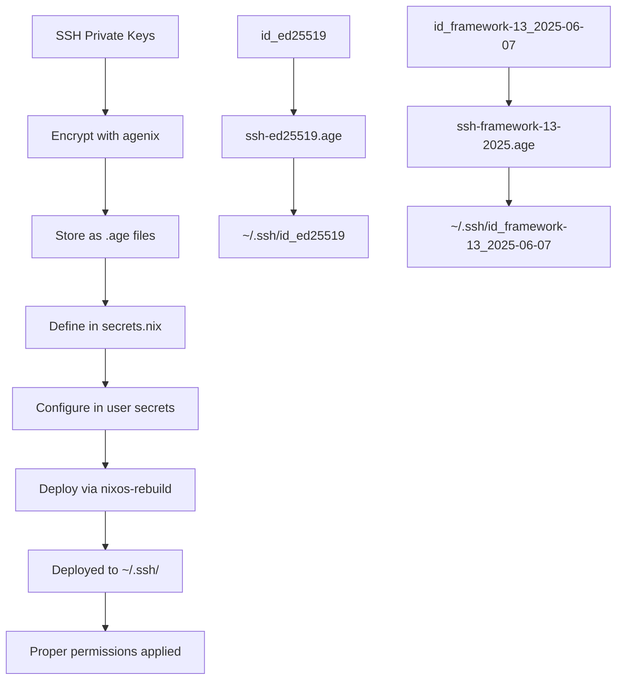

# Age SSH Key Management Implementation Plan

## Overview
This document outlines the complete plan for encrypting SSH private keys using age and managing them through NixOS configuration.

## Current State Analysis

### Existing Configuration
- **Public Keys in `secrets/secrets.nix`**:
  - `framework-13`: `ssh-ed25519 AAAAC3NzaC1lZDI1NTE5AAAAIPh1wLUOuMwH9tCGCRnEJ4lPqex1Ss2aaag6TKc/3hlD nick@hartj.es`
  - `framework-13-2`: `ssh-ed25519 AAAAC3NzaC1lZDI1NTE5AAAAILLBdQCyD8xsKKy5UIUfKS7l+Fl5RQ9yIMR3wGOfL90+ nick@hartj.es`

- **Available SSH Keys**:
  - `/home/nh/.ssh/id_ed25519` (matches framework-13-2 public key)
  - `/home/nh/.ssh/id_framework-13_2025-06-07` (matches framework-13 public key)

- **Currently Encrypted**:
  - `ssh-framework-13.age` - already configured and deployed

### Goals
1. Encrypt both SSH private keys with age
2. Deploy them securely to `.ssh` folder via NixOS configuration
3. Ensure proper permissions and ownership
4. Maintain security best practices

## Implementation Plan

### Phase 1: Update secrets/secrets.nix

**File: `secrets/secrets.nix`**
```nix
let
  # System public keys for encryption (with descriptive comments)
  framework-13 = "ssh-ed25519 AAAAC3NzaC1lZDI1NTE5AAAAIPh1wLUOuMwH9tCGCRnEJ4lPqex1Ss2aaag6TKc/3hlD nick@hartj.es";  # Framework 13 primary key (2025-06-07)
  framework-13-2 = "ssh-ed25519 AAAAC3NzaC1lZDI1NTE5AAAAILLBdQCyD8xsKKy5UIUfKS7l+Fl5RQ9yIMR3wGOfL90+ nick@hartj.es";  # Framework 13 ed25519 key
  
  # All systems that should have universal access
  systems = [framework-13];
  
  # Convenience variable for all authorized keys
  allKeys = [framework-13 framework-13-2] ++ systems;
in {
  # Existing secrets
  "secret1.age".publicKeys = allKeys;
  "ssh-framework-13.age".publicKeys = allKeys;
  
  # New SSH private key secrets
  "ssh-ed25519.age".publicKeys = allKeys;
  "ssh-framework-13-2025.age".publicKeys = allKeys;
}
```

### Phase 2: Update users/nh/secrets.nix

**File: `users/nh/secrets.nix`**
```nix
{
  age = {
    identityPaths = [
      "/home/nh/.ssh/id_framework-13_2025-06-07"  # Primary identity
      "/home/nh/.ssh/id_ed25519"                  # Secondary identity for redundancy
    ];

    secrets = {
      # Existing application secret
      secret2 = {
        file = ../../secrets/secret1.age;
        owner = "nh";
        path = "/home/nh/.secret2";
      };
      
      # SSH Private Keys - all with mode 400 for security
      ssh-framework-13 = {
        file = ../../secrets/ssh-framework-13.age;
        path = "/home/nh/.ssh/id_framework-13";
        mode = "400";
        owner = "nh";
        group = "users";
      };
      
      ssh-ed25519 = {
        file = ../../secrets/ssh-ed25519.age;
        path = "/home/nh/.ssh/id_ed25519";
        mode = "400";
        owner = "nh";
        group = "users";
      };
      
      ssh-framework-13-2025 = {
        file = ../../secrets/ssh-framework-13-2025.age;
        path = "/home/nh/.ssh/id_framework-13_2025-06-07";
        mode = "400";
        owner = "nh";
        group = "users";
      };
    };
  };
}
```

### Phase 3: Encrypt SSH Private Keys

**Commands to run:**

1. **Encrypt the ed25519 private key:**
```bash
agenix -e ssh-ed25519.age
# Copy content from /home/nh/.ssh/id_ed25519
```

2. **Encrypt the framework-13 2025 private key:**
```bash
agenix -e ssh-framework-13-2025.age
# Copy content from /home/nh/.ssh/id_framework-13_2025-06-07
```

### Phase 4: Deploy and Test

**Commands to run:**
```bash
# Apply the configuration
sudo nixos-rebuild switch

# Verify deployment
ls -la /home/nh/.ssh/
# Should show all keys with proper permissions (400 for private keys)

# Test SSH functionality
ssh -T git@github.com  # or another SSH target
```

## Security Considerations

### File Permissions
- **Private Keys**: mode = "400" (read-only for owner)
- **Public Keys**: Default permissions (644)
- **Owner**: "nh"
- **Group**: "users"

### Key Management Best Practices
1. **Backup Strategy**: Keep encrypted backups of private keys
2. **Access Control**: Only necessary public keys in each secret's publicKeys array
3. **Key Rotation**: Plan for periodic key rotation
4. **Identity Paths**: Use multiple identity paths for redundancy

### Encryption Security
- All secrets encrypted with both framework-13 keys
- Can be decrypted by either SSH private key
- Safe to store in version control as encrypted .age files

## Architecture Diagram



## Workflow for Future Key Management

### Adding New SSH Keys
1. Generate new SSH key pair
2. Add public key to `secrets/secrets.nix`
3. Encrypt private key: `agenix -e new-key.age`
4. Add secret configuration to user secrets
5. Deploy with `nixos-rebuild switch`

### Key Rotation Process
1. Generate new key pair
2. Add new public key to secrets configuration
3. Re-encrypt existing secrets with new key
4. Update identity paths
5. Remove old key after verification
6. Update remote systems (GitHub, servers, etc.)

## Benefits of This Approach

1. **Centralized Management**: All SSH keys managed through NixOS config
2. **Version Control Safe**: Encrypted keys safe to commit to git
3. **Automated Deployment**: Keys automatically deployed with proper permissions
4. **Multi-System Support**: Easy to deploy same keys to multiple machines
5. **Security**: Private keys encrypted at rest
6. **Reproducibility**: Identical SSH configuration across systems
7. **Backup**: Encrypted keys serve as secure backup

## Files Modified

1. **`secrets/secrets.nix`** - Add new .age file definitions
2. **`users/nh/secrets.nix`** - Add SSH key secret configurations
3. **New .age files** - Created via agenix encryption

## Next Steps

1. ✅ Document plan (this file)
2. ⏳ Update `secrets/secrets.nix`
3. ⏳ Update `users/nh/secrets.nix`
4. ⏳ Encrypt SSH private keys with agenix
5. ⏳ Test deployment and SSH functionality
6. ⏳ Verify file permissions and ownership

## Troubleshooting

### Common Issues
- **Permission denied**: Check file mode is 400 for private keys
- **Key not found**: Verify path in identityPaths matches deployed location
- **Decryption failed**: Ensure public key is in secret's publicKeys array
- **SSH agent issues**: May need to restart SSH agent after key deployment

### Verification Commands
```bash
# Check file permissions
ls -la ~/.ssh/

# Test SSH key
ssh-keygen -y -f ~/.ssh/id_ed25519

# Check agenix secrets status
sudo systemctl status agenix-*

# View active SSH keys
ssh-add -l
```

This implementation provides a robust, secure, and maintainable approach to SSH key management using age encryption and NixOS configuration management.