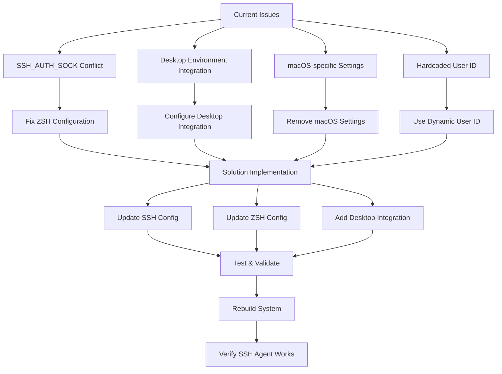

# SSH Agent Fix Plan

## Problem Analysis

The NixOS configuration has SSH keys that aren't being loaded into ssh-agent automatically, despite the service running. Through investigation, I've identified several root causes:

### 1. SSH_AUTH_SOCK Conflict
- **Issue**: [`components/home-manager/cli/zsh.nix:51`](components/home-manager/cli/zsh.nix:51) hardcodes `SSH_AUTH_SOCK=/run/user/1001/ssh-agent`
- **Conflict**: [`components/home-manager/cli/ssh.nix:70`](components/home-manager/cli/ssh.nix:70) systemd service sets `SSH_AUTH_SOCK=%t/ssh-agent`
- **Result**: Shell sessions use wrong socket path, preventing key loading

### 2. Socket Path Assumptions
- **Issue**: Hardcoded path assumes user ID is 1001
- **Problem**: The systemd service uses `%t` (expands to `/run/user/$UID`)
- **Result**: Path mismatch if user ID differs from 1001

### 3. Desktop Environment Integration
- **Context**: Using KDE Plasma with LightDM display manager
- **Issue**: Potential conflicts with desktop environment's own SSH agent handling
- **Result**: Multiple SSH agents or environment variable conflicts

### 4. macOS-specific Settings
- **Issue**: [`components/home-manager/cli/ssh.nix:54`](components/home-manager/cli/ssh.nix:54) includes `UseKeychain yes`
- **Problem**: This setting is macOS-specific and doesn't work on Linux
- **Result**: SSH configuration errors or warnings

## Implementation Plan

### Step 1: Fix SSH Configuration ([`components/home-manager/cli/ssh.nix`](components/home-manager/cli/ssh.nix))

**Changes Required:**
- Remove macOS-specific `UseKeychain yes` setting
- Improve systemd service dependencies and environment variables
- Add better error handling and logging for key loading script
- Ensure compatibility with KDE Plasma desktop environment
- Add session-level environment variable propagation

**Implementation Details:**
- Update [`loadKeysScript`](components/home-manager/cli/ssh.nix:17) with better error handling
- Modify systemd service [`ssh-add-keys`](components/home-manager/cli/ssh.nix:59) for proper environment setup
- Add desktop environment integration hooks

### Step 2: Fix ZSH Configuration ([`components/home-manager/cli/zsh.nix`](components/home-manager/cli/zsh.nix))

**Changes Required:**
- Remove hardcoded [`SSH_AUTH_SOCK=/run/user/1001/ssh-agent`](components/home-manager/cli/zsh.nix:51) export
- Let the systemd service handle socket path properly
- Add conditional logic to respect existing SSH agent if present

**Implementation Details:**
- Remove static SSH_AUTH_SOCK export from [`zshEarlyInit`](components/home-manager/cli/zsh.nix:48)
- Add intelligent SSH agent detection logic
- Preserve other environment variables that are working correctly

### Step 3: Add Desktop Environment Integration

**Changes Required:**
- Configure proper SSH agent integration for KDE Plasma
- Ensure systemd user service starts correctly in desktop session
- Add session-level environment variable propagation

**Implementation Details:**
- Add desktop-specific service dependencies
- Configure environment variable inheritance for desktop session
- Ensure compatibility with LightDM display manager

### Step 4: Improve Key Loading Logic

**Changes Required:**
- Enhanced key existence verification
- Better error handling in key loading script
- Support for password-protected keys with user prompts
- Comprehensive logging for debugging issues

**Implementation Details:**
- Update [`loadKeysScript`](components/home-manager/cli/ssh.nix:17) with robust error handling
- Add logging to systemd journal for troubleshooting
- Implement graceful handling of missing or protected keys

### Step 5: Testing and Validation

**Verification Steps:**
1. Verify systemd services start correctly: `systemctl --user status ssh-agent ssh-add-keys`
2. Check SSH_AUTH_SOCK is set correctly in new shell sessions
3. Verify SSH keys are loaded: `ssh-add -l`
4. Test SSH connections work without password prompts
5. Ensure solution persists across reboots and desktop sessions

## Key Files to Modify

1. **[`components/home-manager/cli/ssh.nix`](components/home-manager/cli/ssh.nix)** - Main SSH agent configuration
2. **[`components/home-manager/cli/zsh.nix`](components/home-manager/cli/zsh.nix)** - Remove conflicting SSH_AUTH_SOCK export

## Expected Outcomes

After implementation:
- SSH keys automatically load into ssh-agent on login
- No conflicts between shell and systemd service socket paths
- Proper integration with KDE Plasma desktop environment
- Robust error handling and logging for troubleshooting
- Cross-session persistence of SSH agent functionality

## Rollback Plan

If issues arise:
1. Git revert changes to restore original configuration
2. Manually start ssh-agent: `eval $(ssh-agent)` and `ssh-add`
3. Check systemd service logs: `journalctl --user -u ssh-add-keys`

## Implementation Priority

1. **High Priority**: Fix SSH_AUTH_SOCK conflict (Steps 1-2)
2. **Medium Priority**: Desktop integration improvements (Step 3)
3. **Low Priority**: Enhanced logging and error handling (Step 4)